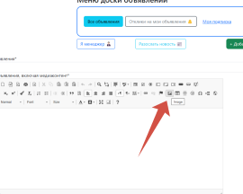
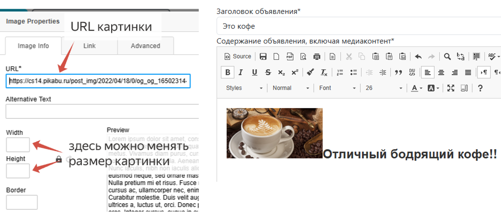

## 🔧 Скачивание проекта и подготовка к запуску

### Клонирование репозитория
Выполните в терминале:

Через SSH (рекомендуется)
```bash
git clone git@github.com:SaitBakhteev/bulletBoard.git
```
Или через HTTPS
```bash
git clone https://github.com/SaitBakhteev/bulletBoard.git
```
Перейдите в директория проекта
```bash
cd bulletBoard
```

### Создание виртуального окружения

```bash
python -m venv venv
```

#### Активация окружения
Windows:
```bash
venv\Scripts\activate
```
Linux/Mac:
```bash
source venv/bin/activate
```
#### Установка зависимостей
```bash
pip install -r requirements.txt
```

### Настройка ключевых параметров в файле окружения
В файле .env нужно прописать значения для следующих переменных:
```ini
SECRET_KEY=<>

# данные для почты
EMAIL_HOST_USER=<>
DEFAULT_FROM_EMAIL=<>
EMAIL_HOST_PASSWORD=<>

# данные для oauth yandex
YANDEX_CLIENT_ID=<>
YANDEX_SECRET=<>

# Данные по redis
REDIS_LOCATION=<>  # адрес хоста redis

# Код для менеджеров
MANAGER_CODE=<>  # код для подтверждения статуса менеджера доски объявлений

```
#### ⚠️ ВАЖНО
*Почтовая рассылка проекта изначально настраивалась на использование Яндекс-провайдера. 
Читайте инструкцию на их портале как получить API-ключ и код для работы почты. 
При этом, если хотите настроить почту от другого провайдера может понадобиться корректировка в settings.py.
Также в settings.py по умолчанию стоит консольная отправка почты:*

```python 
# Такая настройка стоит сейчас в проекте
EMAIL_BACKEND = 'django.core.mail.backends.smtp.EmailBackend'

# Если хотите реальную отправке, то пропишите в настройках так
EMAIL_BACKEND='django.core.mail.backends.console.EmailBackend'
```


### Настройка разрешенных параметров стилизации текста объявления для CkEditor
Текущие настройки выглядят так:

```python
# Настройки фильтрации контента, вводимого через Ck_Editor
BLEACH_ALLOWED_TAGS = [
    'div', 'nav', 'p', 'strong', 'em',
    'u', 's', 'br', 'b', 'i',
    'ul', 'ol', 'li', 'span',
    'h1', 'h2', 'h3', 'h4', 'h5', 'h6',
    'sub', 'sup',
    'a', 'img', 'blockquote'
]

BLEACH_ALLOWED_ATTRIBUTES = {
    '*': ['style', 'class'],
    'a': ['href', 'title', 'target'],
    'img': ['src', 'alt']
}

BLEACH_ALLOWED_STYLES = [
    'color', 'font-size', 'text-align',
    'width', 'height', 'background', 'background-color',
    'background-image', 'padding'
]
```

## 🔑 Запуск проекта и работа с ним
<h3>❗️ВАЖНО<br></h3>
<H3><i>Для работы проекта у Вас должен быть предварительно запущен сервер Redis</i>i</H3>

### 1. Откройте три терминала и выполните действия в следующем порядке:
- в первом терминале запустите сервер командой
```bash
python manage.py runserver
```
- во втором терминале запустите командой
```bash
# для windows
celery -A bulletBoard worker -l INFO --pool=solo

# для linux/macOS 
celery -A bulletBoard worker -l INFO
```
- в третьем терминале запустите командой
```bash
# для windows
celery -A bulletBoard worker beat -l INFO
```

### 2. Теперь Вы можете просматривать список объявлений и отдельные объявления.
### 3. Пройдите регистрацию, в форме подтверждения почты введите код, высланный Вам на почту.
### 4. После этого авторизуйтесь на портале доски объявлений со своим логином (*адрес электронной почты*) и паролем.
<span style="color: #fd7e14">Если Вы так и не подтвердили почту, то при попытке авторизации Вам снова будет выслан код для подтверждения.</span>

### 4. После авторизации Вам будут доступны следующие функции:
- создание и редактирование объявлений с помощью специального редактора CkEditor (см. [ниже](#работа-с-ckeditor))
- оставлять отклики на чужие объявления, принимать или удалять отклики на свои объявления
- получать уведомления на почту, если на Ваше объявление пришел отклик
- получать уведомления на почту, если Ваш отклик одобрен автором объявления
- настраивать подписку по категориям объявлений 
- получать еженедельные новостные уведомления по вышедшим за неделю объявлениям тех категорий, на которые Вы подписаны
- стать менеджером портала доски объявлений введя код из .env
- менеджеры доски объявлений могут делать массовую рассылку всем активным пользователям портала


### Работа с CkEditor
В редакторе можно с помощью стандартных инструментов менять размеры, цвет текста и т.д.
Также с помощью редактора можно вставлять картинки в текст объявления, для этого:
- нажмите на инструмент image на панели инструментов<br>

<br><br>
- в открывшемся окне в поле <b><i>URL*</i></b> вставьте URL-адрес картинки.
При необходимости в этом же окне можете изменить размеры картинки.
Нажмите затем OK и картинка вставится<br>



#### ⚠️ ВАЖНО
*Стилизация некоторых инструментов CkEditor может экранироваться. 
Все зависит от прописанных настроек в settings.py.* 
*Как изменить допустимые параметры стилизации текста* 
см. [выше](#настройка-разрешенных-параметров-стилизации-текста-объявления-для-ckeditor)
